# Peter Moss COVID-19 AI Research Project
## COVID-19 xDNN
### COVID-19 xDNN Matlab Classifier
#### Installation

[](https://github.com/COVID-19-AI-Research-Project/xDNN/tree/master/Projects/Matlab/1)

 

# Table Of Contents

- [Introduction](#introduction)
- [Required Hardware](#required-hardware)
    - [System Configurations](#system-configurations)
- [Prerequisites](#prerequisites)
  - [MATLAB Software R2020a](#matlab-software-r2020a)
  - [Python3](#python3)
  - [Clone the Repository](#clone-the-repository)
    - [Developer Forks](#developer-forks)
- [Installation](#installation)
  - [Installing Matlab](#installing-matlab)
  - [Installing the Matlab Engine API](#installing-the-matlab-engine-api)
  - [Configuration](#configuration)
- [Contributors](#contributors)
- [Versioning](#versioning)
- [License](#license)
- [Bugs/Issues](#bugsissues)

 

# Introduction
The following guide will take you through setting up and installing the  [ COVID-19 xDNN Matlab Classifier](https://github.com/COVID-19-AI-Research-Project/xDNN/tree/master/Projects/Matlab/1 " COVID-19 xDNN Matlab Classifier").

 

# Required Hardware

## System Configurations

In this project we used:

- Processor - i3, 4th GEN(min)
- Graphic Card - Geforce 920MX(min)
- RAM Card - 4 GB(min)
- Disk Space - 24 GB(min)

 

# Prerequisites

## MATLAB Software R2020a
It is mandatory to download the copy of [MATLAB](https://in.mathworks.com/) or the MATLAB installer onto your system after you fill out the required information to get it. Some users choose to receive a DVD in the mail instead of downloading the product online. No matter which technique you use, you eventually get a copy of MATLAB to install.

In most cases, you need to download the copy of MATLAB or the MATLAB installer onto your system after you fill out the required information to get it. Some users choose to receive a DVD in the mail instead of downloading the product online. No matter which technique you use, you eventually get a copy of MATLAB to install.

## Python3
Download the [Python 3](https://www.python.org/downloads/) as MATLAB 2020 will support releases upto Python 3.7 for calling MATLAB functions through MATLAB engine from python scripts.

After downloading the package, follow the below Environment Setup and add the PATH for the given Python Version.


## Clone the Repository

Clone the [COVID-19 xDNN](https://github.com/COVID-19-AI-Research-Project/xDNN " COVID-19 xDNN") repository from the [Peter Moss COVID-19 AI Research](https://github.com/COVID-19-AI-Research-Project "Peter Moss COVID-19 AI Research") Github Organization.

To clone the repository and install this project, make sure you have Git installed. Now navigate to the home directory on your device using terminal/commandline, and then use the following command.

```
  $ git clone https://github.com/COVID-19-AI-Research-Project/xDNN.git
```

Once you have used the command above you will see a directory called **xDNN** in your home directory.

```
ls
```

Using the ls command in your home directory should show you the following.

```
XDNN
```

Navigate to **COVID-19-AI-Research-Project/XDNN/Projects/Matlab/1** directory, this is your project root directory for this tutorial.

### Developer Forks
Developers from the Github community that would like to contribute to the development of this project should first create a fork, and clone that repository. For detailed information please view the [CONTRIBUTING](../../../../../CONTRIBUTING.md "CONTRIBUTING") guide. You should pull the latest code from the development branch.

```
  $ git clone -b "0.2.0" https://github.com/COVID-19-AI-Research-Project/xDNN.git
```

The **-b "0.2.0"** parameter ensures you get the code from the latest master branch. Before using the below command please check our latest master branch in the button at the top of the project README.

 

# Installation

## Installing Matlab
Follow these steps to install the MATLAB 2020.

1. Open browser and Type MATLAB in search bar or click on the link.
MATLAB-Trial-R2020a

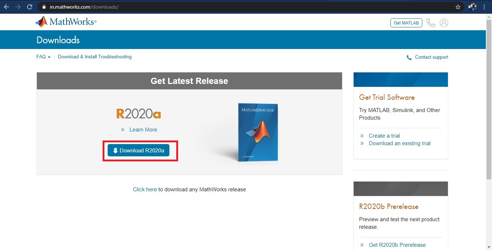

2. After clicking on the download option the page will be diverted to the login.

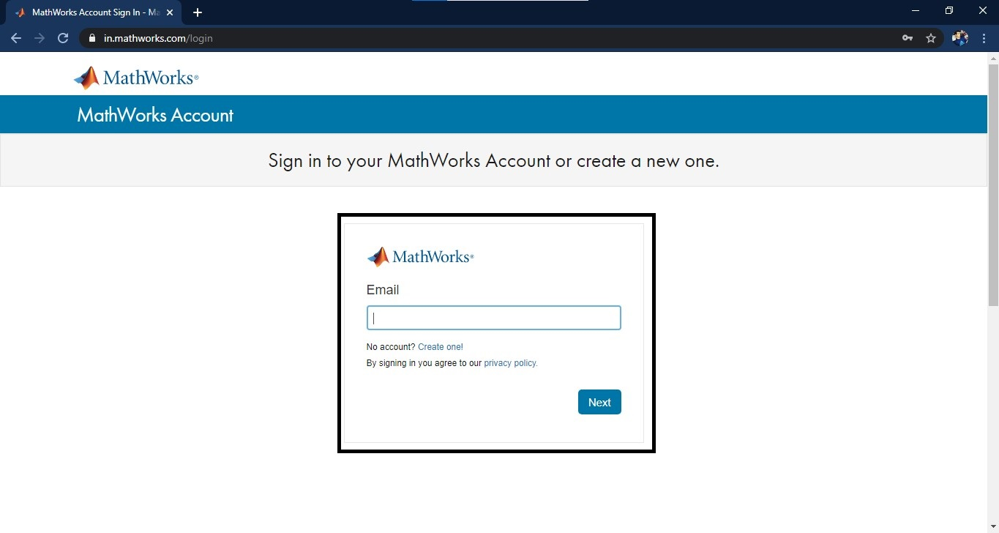

3. Type the email-id and password if not then signup from the same page. It will pop-up a verification message.

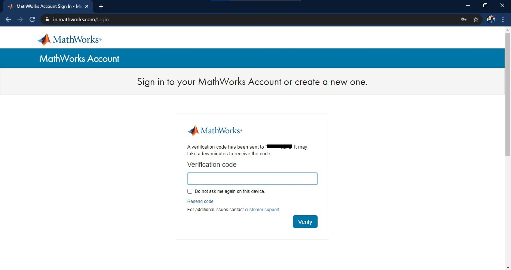

4. After sign in to the account. It will show this page.

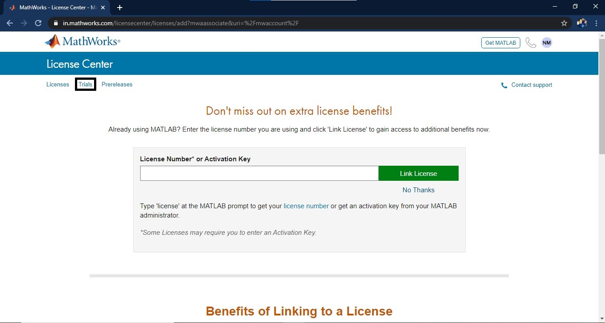

5. In the trial section, it is notified with the trial license if using first time.

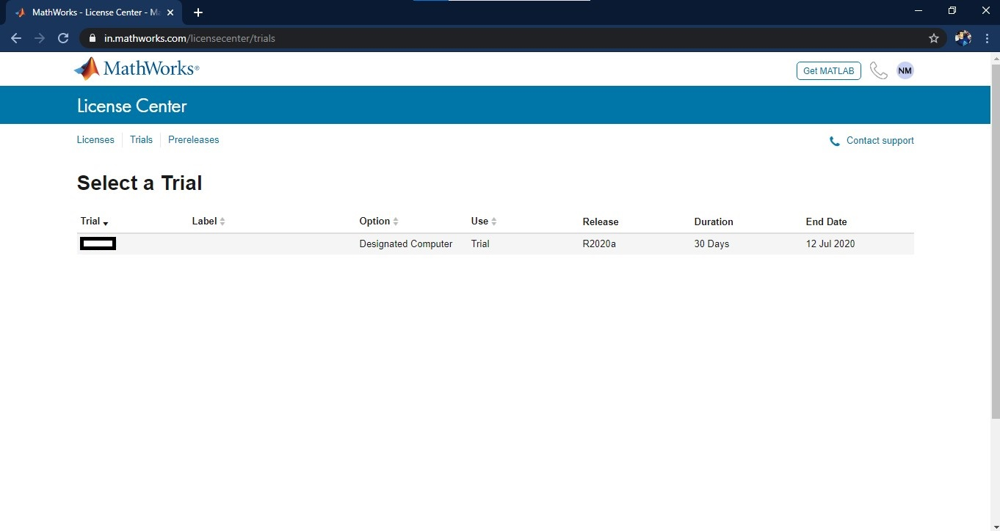

6. Click in the license section, a new window will open. Select the trial package of Deep Learning to Download.

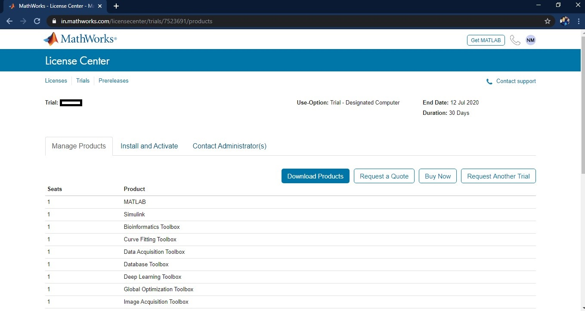

7. Click Download installer button.

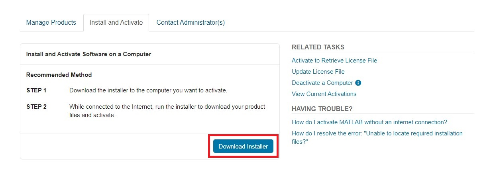

8. A new page will open and diverted to the downloading files. Select the files depending on the operating system.

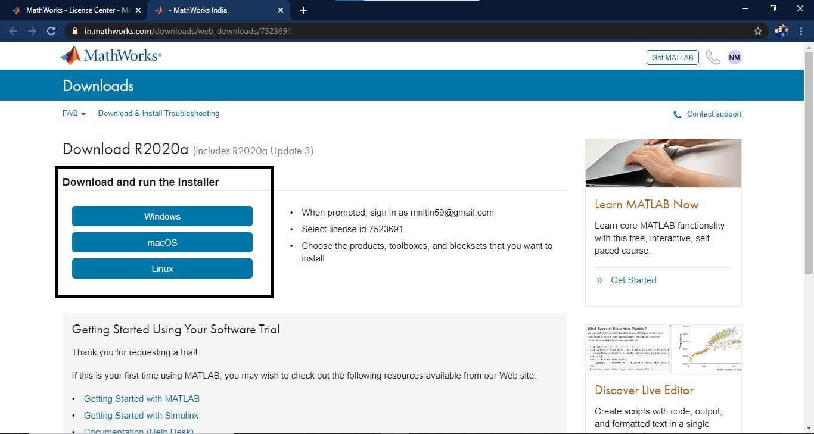

9. Installer File will be getting downloaded.

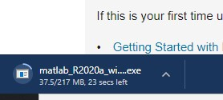

10. After downloading file. It will show like the .exe file for windows.


11. Click on the matlab_R2020a_win64.exe file. This will extract the installation file setup in the temporary file.

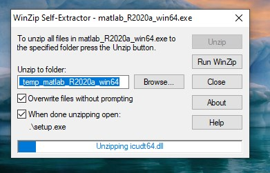

12. After extracting the application will ask for the running file. Accept it and you will see MATLAB Logo.


13. The application will ask for the email and password.

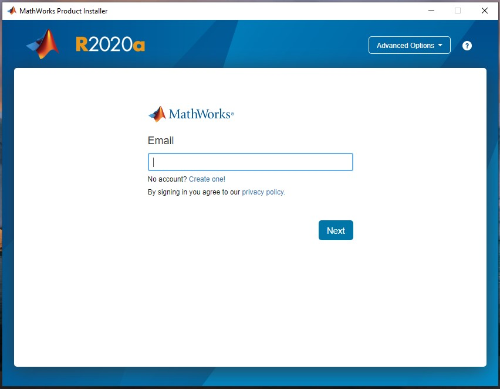

14. It will again ask for the verification code which is sent to the mobile phone.

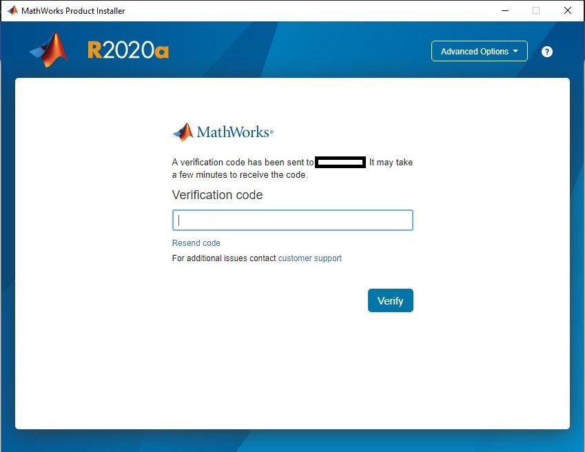

15. Read all the license agreement and accept it.

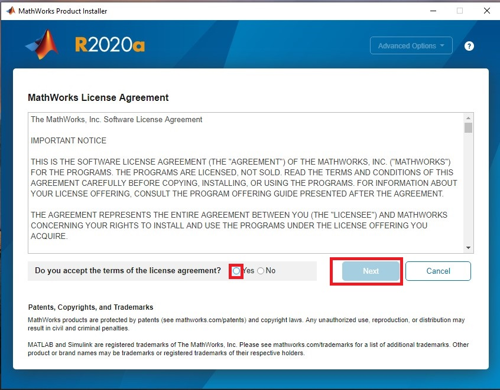

16. Select the license type.


17. Select the destination path or leave it as default path, click next

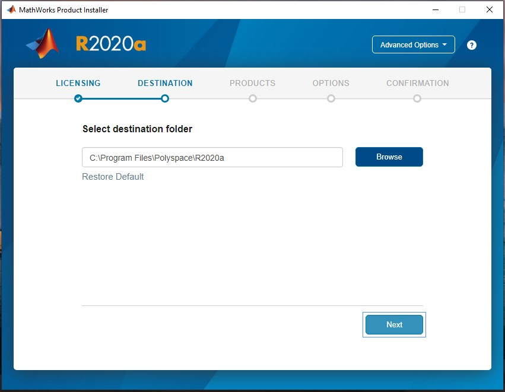

18. Select the packages which are needed to installed in custom or select all, click next

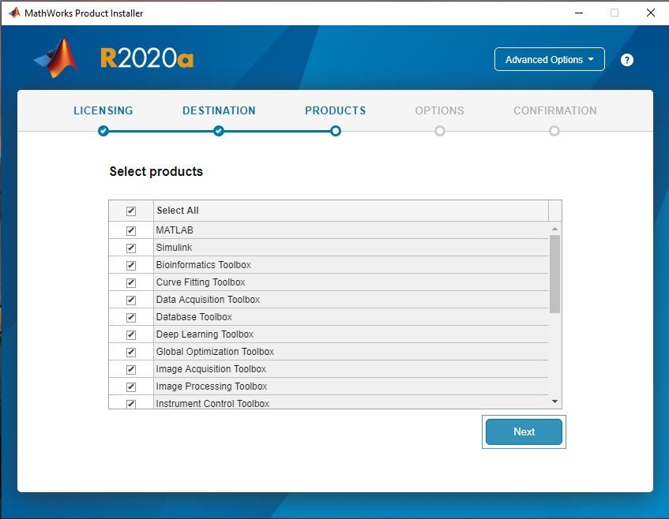

19. In the option, select the add shortcut to desktop and click next.

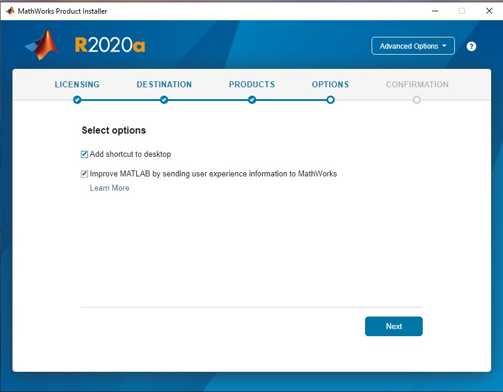

20. The MATLAB software will be getting installed and get confirmed.

21. Now select the MATLAB R2020a icon on the desktop and double click.

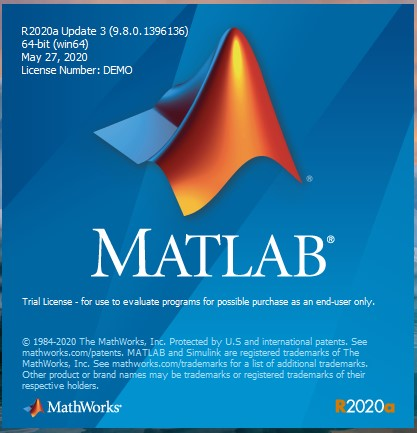

22. The software will show this UI and need to wait for few minutes for inital setup and configuration in the backend program.

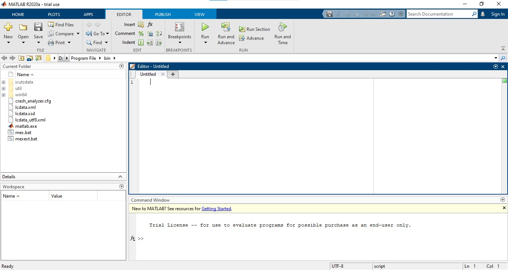

## Installing Required Python Libraries
The following dependencies are required to be installed:

```
pip3 install pillow
pip3 install flask
pip3 install gevent
pip3 install numpy
pip3 install werkzeug
pip3 install jsonpickle
```

## Installing the Matlab Engine API
After Successfully installing python and its libraries, we will install Matlab Engine API to call matlab functions from python Scripts. The Matlabroot folder is generally found in Program Files Directory of C Drive(C:\Program Files\MATLAB\R2020a) in Windows, however the location can change as per preferred choice by user during installation.

At a Windows operating system prompt —

```
cd "C:\Program Files\MATLAB\R2020a\extern\engines\python"
python setup.py install
```

After a successfull installation of MATLAB Engine API, start Python, import the module, and start the MATLAB engine:

```
import matlab.engine
eng = matlab.engine.start_matlab()
```

## Configuration

You will find the configuration file in the project 1 root directory.
```
{   "server": {
        "ip": "127.0.0.1",
        "port": 5000
    }
}
```

 

# Continue

Now continue with the [COVID-19 Matlab xDNN Project 1](../../ "COVID-19 Matlab xDNN Project 1") tutorial.

 

# Contributing

The Peter Moss COVID-19 AI Research Project encourages and welcomes code contributions, bug fixes and enhancements from the Github.

Please read the [CONTRIBUTING](../../../CONTRIBUTING.md "CONTRIBUTING") document for a full guide to forking our repositories and submitting your pull
requests. You will also find information about our code of conduct on this page.

## Contributors

- [Aniruddh Sharma](https://www.leukemiaresearchassociation.ai/team/aniruddh-sharma "Aniruddh Sharma") - [Asociacion De Investigatcion En Inteligencia Artificial Para La Leucemia Peter Moss](https://www.leukemiaresearchassociation.ai "Asociacion De Investigacion En Inteligencia Artificial Para La Leucemia Peter Moss") R&D Junior, Ahmedabad, Gujarat, India

- [Nitin Mane](https://www.leukemiaresearchassociation.ai/team/nitin-mane "Nitin Mane") - [Asociacion De Investigatcion En Inteligencia Artificial Para La Leucemia Peter Moss](https://www.leukemiaresearchassociation.ai "Asociacion De Investigacion En Inteligencia Artificial Para La Leucemia Peter Moss") AI R&D, Aurangabad, India

 

# Versioning

You use SemVer for versioning. For the versions available, see [Releases](../../../../../releases "Releases").

 

# License

This project is licensed under the **MIT License** - see the [LICENSE](../../../../../LICENSE "LICENSE") file for details.

 

# Bugs/Issues

We use the [repo issues](../../../../../issues "repo issues") to track bugs and general requests related to using this project. See [CONTRIBUTING](../../../../../CONTRIBUTING.md "CONTRIBUTING") for more info on how to submit bugs, feature requests and proposals.
