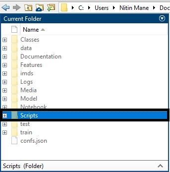
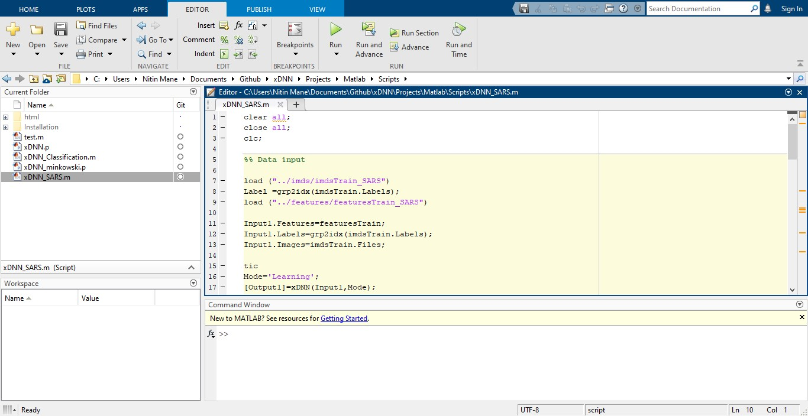
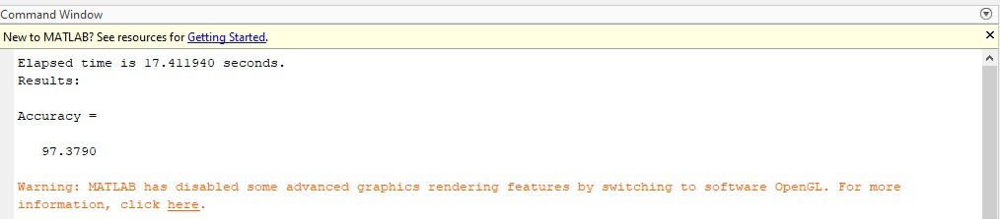
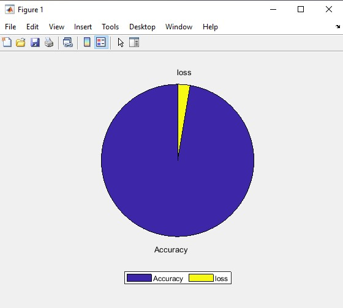
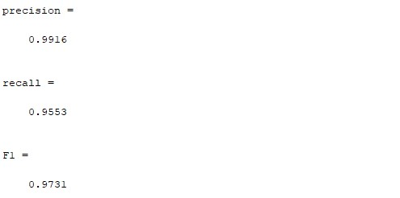
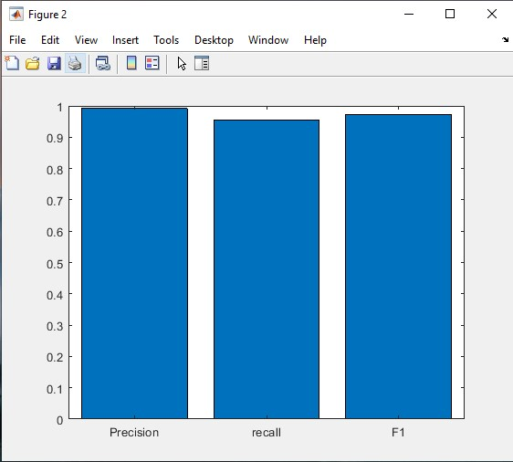
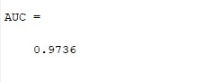
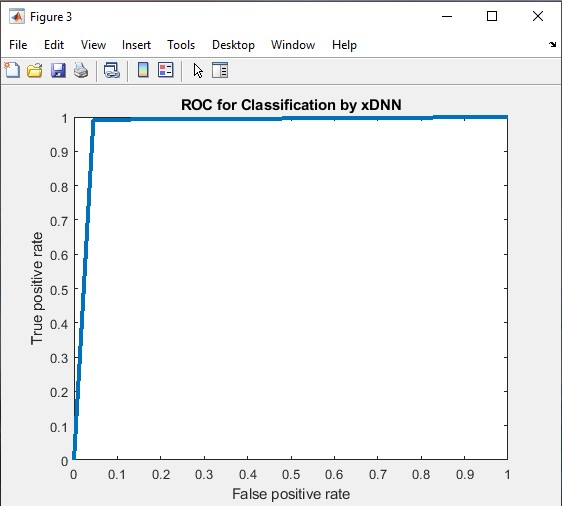

# Peter Moss COVID-19 AI Research Project
## COVID-19 xDNN Classifiers

    

#  Introduction

The contamination by SARS-CoV-2 which causes the COVID-19 disease has generally spread everywhere throughout the world since the start of 2020. On January 30, 2020, the World Health Organization (WHO) proclaimed a worldwide health crisis. Analysts of various orders work alongside general health authorities to comprehend the SARS-CoV-2 pathogenesis and together with the policymakers direly create techniques to control the spread of this new disease.

Recent findings have observed imaging patterns on computed tomography (CT) for patients infected by SARS-CoV-2.

In this research, we have used a public available COVID-CT dataset, containing 1252 CT scans that are positive for SARS-CoV-2 infection (COVID-19) and 1230 CT scans for patients non-infected by SARS-CoV-2.
These data have been collected from real patients in hospitals from Sao Paulo, Brazil.
The aim of this dataset is to encourage the research and development of artificial intelligent methods which are able to identify if a person is is infected by SARS-CoV-2 through the analysis of his/her CT scans.
As baseline result for this dataset we used an eXplainable Deep Learning approach (xDNN) which we could achieve an F1 score of 0.9731 which is very promising.
The data is available www.kaggle.com/plameneduardo/sarscov2-ctscan-dataset.

# Project - MATLAB xDNN

Go to the project file > select the MATLAB Folder

Select the script folder and double click on it. The path should enter into the script

You will see the scripts for xDNN files. Select the xDNN_SARS.m file and click on the run option.

After running file, the command prompt will show the accurary result.

The accuracy result are shown in the pie chart.

The other parameters like recall, precision and F1 results are shown in the command prompt.

Likewise, the results are plotted into the bar for better understanding the results in visual manner.

The AUC curve has shown the performance measurement for classification of COVID and Non-COVID images at various thresholds settings. The best results are 97.36%.

The xDNN model performances are shown in the graph.

The COVID and Non-COVID classes which are trained in the xDNN model are shown the results in classification truth table. This shows the classification are well accurate and can be implemented for classifying patient images. (This can be analytical)

## Research cite:

Angelov, P., & Soares, E. (2019). Towards Explainable Deep Neural Networks (xDNN). arXiv preprint arXiv:1912.02523.

Angelov, Plamen, and Eduardo Almeida Soares. "EXPLAINABLE-BY-DESIGN APPROACH FOR COVID-19 CLASSIFICATION VIA CT-SCAN." medRxiv (2020).

Soares, Eduardo, Angelov, Plamen, Biaso, Sarah, Higa Froes, Michele, and Kanda Abe, Daniel. "SARS-CoV-2 CT-scan dataset: A large dataset of real patients CT scans for SARS-CoV-2 identification." medRxiv (2020). doi: https://doi.org/10.1101/2020.04.24.20078584.
Link: https://www.medrxiv.org/content/10.1101/2020.04.24.20078584v2
