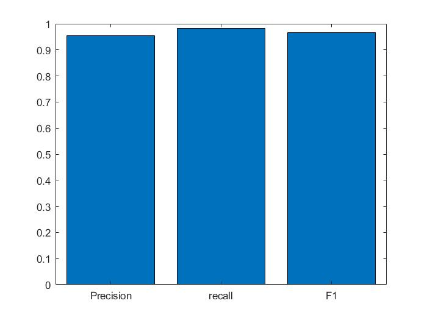

# Peter Moss COVID-19 AI Research Project

## COVID-19 xDNN

### COVID-19 xDNN Matlab Classifier

[]()

[](https://github.com/COVID-19-AI-Research-Project/xDNN/tree/0.0.0) [](https://github.com/COVID-19-AI-Research-Project/xDNN/tree/0.1.0) [](CONTRIBUTING.md) [](issues) [](LICENSE)

&nbsp;

# Table Of Contents

- [Introduction](#introduction)
- [DISCLAIMER](#disclaimer)
- [Installation](#installation)
- [Train](#train)
  - [Start Training](#start-training)
  - [Training Results](#training-results)
  - [Metrics Overview](#metrics-overview)
  - [Figures Of Merit](#figures-of-merit)
  - [Training on your own Dataset](#training-on-your-own-dataset)
- [Real World Testing](#real-world-testing)
- [Citation](#citation)
- [Contributing](#contributing)
  - [Contributors](#contributors)
- [Versioning](#versioning)
- [License](#license)
- [Bugs/Issues](#bugsissues)


#  Introduction

The contamination by SARS-CoV-2 which causes the COVID-19 disease has generally spread everywhere throughout the world since the start of 2020. On January 30, 2020, the World Health Organization (WHO) proclaimed a worldwide health crisis. Analysts of various orders work alongside general health authorities to comprehend the SARS-CoV-2 pathogenesis and together with the policymakers direly create techniques to control the spread of this new disease.

Recent findings have observed imaging patterns on computed tomography (CT) for patients infected by SARS-CoV-2.

In this research, we have used a public available [SARS-COV-2 Ct-Scan Dataset](https://www.kaggle.com/plameneduardo/sarscov2-ctscan-dataset),
containing 1252 CT scans that are positive for SARS-CoV-2 infection (COVID-19) and 1230 CT scans for patients non-infected by SARS-CoV-2.
This dataset of CT scans for SARS-CoV-2 (COVID-19) identification is created by our collaborators, Plamenlancaster:
[Professor Plamen Angelov](https://www.lancaster.ac.uk/lira/people/#d.en.397371) from [Lancaster University](https://www.lancaster.ac.uk/)/
Centre Director @ [Lira](https://www.lancaster.ac.uk/lira/), & his researcher,
[Eduardo Soares PhD](https://www.lancaster.ac.uk/sci-tech/about-us/people/eduardo-almeida-soares).

These data have been collected from real patients in hospitals from Sao Paulo, Brazil.

The aim of this dataset is to encourage the research and development of artificial intelligent methods which are able to identify if a person is is infected by SARS-CoV-2 through the analysis of his/her CT scans.
As baseline result for this dataset we used an eXplainable Deep Learning approach (xDNN) which we could achieve an F1 score of **0.9672** which is very promising.

&nbsp;

# DISCLAIMER

This project should be used for research purposes only. The purpose of the project is to show the potential of Artificial Intelligence for medical support
systems such as diagnosis systems. Although the program is fairly accurate and shows good results both on paper and in real world testing, it is not meant
to be an alternative to professional medical diagnosis. I am a self taught developer with some experience in using Artificial Intelligence for detecting
certain types of cancer and COVID-19. I am not a doctor, medical or cancer/COVID-19 expert. Please use this system responsibly.

&nbsp;

# Installation

Please follow the [Installation Guide](../1/Documentation/Installation/Installation.md) to install COVID-19 xDNN Matlab Classifier.

# Train

Assuming you have completed the installation guide, you can now begin training.

## Start Training

Open Matlab2020 and navigate to the project root directory and execute the following command:

```
TrainModel
```

## Training Results

The trained model files can be found in **Model/Pretrained** location, this contains a MAT file which is trained on 1737 images containing xDNN Parameters.
 When the training finishes the model will show the results related to metrics and figures of merit.

```
Elapsed time is 9.566493 seconds.
Results:

Accuracy =

   96.6443


precision =

    0.9535


recall =

    0.9814


F1 =

    0.9672


AUC =

    0.9663


Confusion_Matrix =

   369     7
    18   351
```


_Fig 1. Accuracy_


_Fig 2. ROC/AUC_



_Fig 3. Precision, Recall and F1_


_Fig 4. Confusion Matrix_

### Metrics Overview

| Accuracy  | Recall     | Precision  | AUC/ROC   |
| --------- | ---------- | ---------- | --------- |
| 0.966443  |  0.9814    | 0.9535     | 0.9663    |

### Figures Of Merit

| Figures of merit     | Amount/Value      | Percentage  |
| -------------------- | ------------------| ------------|
| True Positives       | 369               | 49.5302013% |
| False Positives      | 7                 | 0.9395973%  |
| True Negatives       | 351               | 47.1140939% |
| False Negatives      | 18                | 2.4161073%  |
| Misclassification    | 25                | 3.3557046%  |
| Sensitivity / Recall | 0.9814            | 98%         |

## Training on your own Dataset

The Matlab file [DatasetAndFeaturesPreparation.m](../1/DatasetAndFeaturesPreparation.m) can be used to make the IMDS and Features MAT files for training
on your own dataset. Before running the above script, paste the dataset folder with containing subfolders in the project root directory. After running
the above script save the generated imdsTrain, imdsValidation mat files in [**Imds**](../1/Model/Imds) and featuresTrain, featuresTest in
[**Features**](../1/Model/Features) Folder.

&nbsp;

# Real World Testing

For testing the model and getting the results on random CT Lung Scan Images, we will upload an Image on a webpage for the given default IP Address and
Port in [config.json](../1/config.json#L25), then it will provide the result for the given Image.The webpage interface to upload and predict images is
one using Flask API and we will use python script [Server.py](../1/Server.py), which will call Flask API to interact with the webpage and
call the [PredictImage.m](../1/PredictImage.m) matlab function through MATLAB Engine API Library which uses the pretrained model to classify the
uploaded Image.

To test an Image, navigate to the project root and exectute the following command:

```
python3 Server.py
```

The Script will start running and initiate both MATLAB Engine API and Flask API.

```
 * Serving Flask app "Server" (lazy loading)
 * Environment: production
   WARNING: This is a development server. Do not use it in a production deployment.
   Use a production WSGI server instead.
 * Debug mode: on
 * Restarting with stat
 * Debugger is active!
 * Debugger PIN: 156-368-932
 * Running on http://127.0.0.1:5000/ (Press CTRL+C to quit)

```

Now go to your default browser and search for given HTTP address: http://127.0.0.1:5000/. You will see a web page as shown below:


Now Upload any JPG, JPEG or PNG CT Scan image file by clicking **Upload Image**. Keep in Mind that the Image file should have at atleast size of
 (224,224) image pixels. After Uploading Image, click on **Show Results**:

 

The Web Page can take 2-3 minutes to calculate and show the results as the Matlab API engine is run from python. It can take few minutes and performance
varies with the given System Configurations.


After Sometime it will give results for the uploaded Image as shown:


&nbsp;

# Citation

```
Angelov, Plamen, and Eduardo Almeida Soares. "EXPLAINABLE-BY-DESIGN APPROACH FOR COVID-19 CLASSIFICATION VIA CT-SCAN." medRxiv (2020).
Soares, Eduardo, Angelov, Plamen, Biaso, Sarah, Higa Froes, Michele, and Kanda Abe, Daniel. "SARS-CoV-2 CT-scan dataset: A large dataset of real
patients CT scans for SARS-CoV-2 identification." medRxiv (2020). doi: https://doi.org/10.1101/2020.04.24.20078584.

Link:
https://www.medrxiv.org/content/10.1101/2020.04.24.20078584v2
```

&nbsp;

# Contributing

The Peter Moss COVID-19 AI Research Project encourages and welcomes code contributions, bug fixes and enhancements from the Github.

Please read the [CONTRIBUTING](../../../CONTRIBUTING.md "CONTRIBUTING") document for a full guide to forking our repositories and submitting your pull
requests. You will also find information about our code of conduct on this page.

## Contributors

- [Aniruddh Sharma](https://www.leukemiaresearchassociation.ai/team/aniruddh-sharma "Aniruddh Sharma") -
[Peter Moss Leukemia AI Research](https://www.leukemiaresearchassociation.ai "Peter Moss Leukemia AI Research") R&D Junior, Ahmedabad, Gujarat, India.

- [Nitin Mane](https://www.leukemiaresearchassociation.ai/team/nitin-mane "Nitin Mane") - [Peter Moss Leukemia AI Research](https://www.leukemiaresearchassociation.ai "Peter Moss Leukemia AI Research")
AI R&D, Aurangabad, India.

&nbsp;

# Versioning

We use SemVer for versioning. For the versions available, see [Releases](../../../../../releases "Releases").

&nbsp;

# License

This project is licensed under the **MIT License** - see the [LICENSE](../../../LICENSE "LICENSE") file for details.

&nbsp;

# Bugs/Issues

We use the [repo issues](../../../../../issues "repo issues") to track bugs and general requests related to using this project. See
[CONTRIBUTING](../../../CONTRIBUTING.md "CONTRIBUTING") for more info on how to submit bugs, feature requests and proposals.
