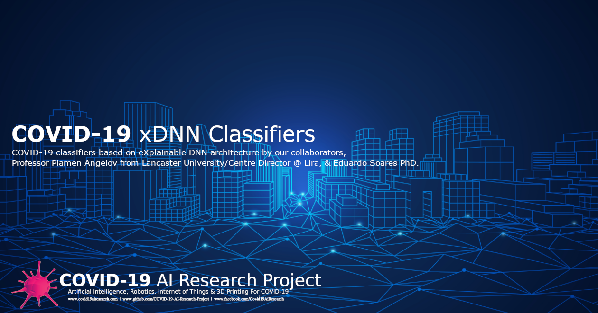

# Peter Moss COVID-19 AI Research Project
## COVID-19 xDNN Python Classifier
[](https://github.com/COVID-19-AI-Research-Project/xDNN)

&nbsp;

# Table Of Contents

- [Introduction](#introduction)
- [Required Hardware](#required-hardware)
- [Prerequisites](#prerequisites)
- [Installation](#installation)
  [Clone the Repository](#clone-the-repository)
    -  [Developer Forks](#developer-forks)
- [Contributing](#contributing)
    - [Contributors](#contributors)
- [Versioning](#versioning)
- [License](#license)
- [Bugs/Issues](#bugs-issues)

&nbsp;

# Introduction
The following guide will take you through setting up and installing the  [ COVID-19 xDNN Python Classifier](https://github.com/COVID-19-AI-Research-Project/xDNN/Projects/Python " COVID-19 xDNN Python Classifier").

The xDNN Classifier is a process of predicting class or category from observed features or given data file in less time compared to the ordinary model. This is a lightweight model
and easy to consume dataspace for the training and testing features and provide necessary operation. there are many variants in the model which provide an accurate result with consuming huge
data from the server or the machine. this method provides an edge computing device freedom of evaluating the xDNN is utilizing models. Models are genuine preparing information tests
 (pictures), which are neighbourhood pinnacles of the observational information conveyance called regularity just as of the information thickness. This generative model is 
 distinguished in a shut structure and likens to the pdf yet is gotten consequently and altogether from the preparation information with no client or issue explicit edges, 
 boundaries or intercession. The proposed xDNN offers another profound learning design that consolidates thinking and learning in cooperative energy. 
 It is non-iterative and non-parametric, which clarifies its productivity regarding time and computational assets.

&nbsp;

# Required Hardware

Basic Computer Configuration:

1. Processor    - Intel i3 or above 
2. Ram          - 4 GB or above
3. Harddisk     - 10 GB space
4. Graphics Card - NVIDIA GTX1050 (Optional)

&nbsp;

# Prerequisites 

The required operating system can be Windows, Linux or MacOS. 

The software required are as follows:
1. [Python IDE](https://www.python.org/)
2. [Tensorflow Library 2.4.0](https://www.tensorflow.org/install/pip)
3. [PyTorch Libary](https://pytorch.org/) (Optional)
4. [Flask](https://flask.palletsprojects.com/en/1.1.x/)

&nbsp;

# Installation 

### Install python on Windows OS 

First install the [Python IDE](https://www.python.org/downloads/) and navigate to the command prompt. It is recommended to install python 3.6.5 version. Download from the given [link](https://www.python.org/downloads/release/python-365/). While installing the python software tick the option `Add Python 3.6 to PATH` and click on install now. The python will take sometime to install. After installation restart the operating system and open command prompt. To verify the python is install in the system use the following command. 

```
python --version
```

### Install python on Linux OS

Install the python IDE using the following command in the terminal. 

```
$ sudo apt install python3.6
```

While installing python the terminal will ask the permission to download file. Press 'y' for yes and the command will proceed with the downloading and installing file in system. 

### Python Virtual Environment

Install the virtual environment package for creating a environment for the project and avoiding libraies issue on the base or other project environment. To install the package follow the given command:

```
python -m pip install --user virtualenv
```

Create a new environment for Python 3.6.5 as by default the python IDE has python 3.8.0 installed default. 
In windows OS use the following command:

```
python -m venv py365 python=3.6.5
```

for linux OS use the following command:

```
$ python(3) -m venv py365 python=3.6.5
```

This will create python environment with the version 3.6.5. 

For windows use the following command for the activating the virtual environment in command prompt. 

```
./py365/bin/activate
```

 For Linux use this command in the terminal: 
```
$ source py365/bin/activate
```

Additional Linux Install System File 

Compiling a package from source code requires additional software.

Enter the following to install the required packages for Python:

```
$ sudo apt install build-essential zlib1g-dev libncurses5-dev libgdbm-dev libnss3-dev libssl-dev libreadline-dev libffi-dev wget
```

Upgrading pip package for installing the latest packages in the python environment. Use the following command:

```
python3 -m pip install --upgrade pip
```

## Clone the Repository

Clone the [COVID-19 xDNN](https://github.com/COVID-19-AI-Research-Project/xDNN " COVID-19 xDNN") repository from the [Peter Moss COVID-19 AI Research](https://github.com/COVID-19-AI-Research-Project "Peter Moss COVID-19 AI Research") Github Organization.


To clone the repository and install this project, make sure you have Git installed. Now navigate to the home directory on your device using terminal/commandline, and then use the following command.

```
  $ git clone https://github.com/COVID-19-AI-Research-Project/xDNN.git
```

### Developer Forks
Developers from the Github community that would like to contribute to the development of this project should first create a fork, and clone that repository. For detailed information please view the [CONTRIBUTING](../../../../../CONTRIBUTING.md "CONTRIBUTING") guide. You should pull the latest code from the development branch.

```
  $ git clone -b "0.2.0" https://github.com/COVID-19-AI-Research-Project/xDNN.git
```

The **-b "0.2.0"** parameter ensures you get the code from the latest master branch. Before using the below command please check our latest master branch in the button at the top of the project README.

&nbsp;

### Go to Project Directory path 

Once you have used the command above you will see a directory called **xDNN** in your home directory.

For Windows prompt use the following command
```
dir
```

For linux terminal use the following command
```
ls
```

Using the ls or dir command in your home directory should show you the following directory files.

Now navigate the download file which is saved in the home directory file using the following command. 

```
cd xDNN
```

Go to the project path using the following command:

```
cd Projects/Python/1
```
### Install dependencies packages

The dependency are required for the executing code therefore its recommended to install the following packages or else use the text script for downloading packages in from the command prompt or terminal. 

If using manual installation procedure. You can follow the installation commands for each packages:

```
pip(3) install urllib3
pip(3) install pandas
pip(3) install numpy
pip(3) install matplotlib
pip(3) install scikit-plot
pip(3) install scikit-learn
pip(3) install tensorflow==2.4.0
pip(3) install Flask
pip(3) install Werkzeug
pip(3) install WSGIserver
pip(3) install gevent
```

 This will take some time to install the dependencies as it may consume more data depending on the file. 
 
&nbsp;

# Contributing

Peter Moss COVID-19 AI Research Project encourages and welcomes code contributions, bug fixes and enhancements from the Github.

Please read the [CONTRIBUTING](../../CONTRIBUTING.md "CONTRIBUTING") document for a full guide to forking your repositories and submitting your pull requests. You will also find information about your code of conduct on this page.

## Contributors

- [Nitin Mane](https://www.leukemiaresearchassociation.ai/team/nitin-mane "Nitin Mane") - [Peter Moss Leukemia AI Research](https://www.leukemiaresearchassociation.ai "Peter Moss Leukemia AI Research") AI R&D, Aurangabad, India

&nbsp;

# Versioning

You use SemVer for versioning. For the versions available, see [Releases](../../releases "Releases").

&nbsp;

# License

This project is licensed under the **MIT License** - see the [LICENSE](../../LICENSE "LICENSE") file for details.

&nbsp;

# Bugs/Issues

You use the [repo issues](../../issues "repo issues") to track bugs and general requests related to using this project. See [CONTRIBUTING](../../CONTRIBUTING.md "CONTRIBUTING") for more info on how to submit bugs, feature requests and proposals.