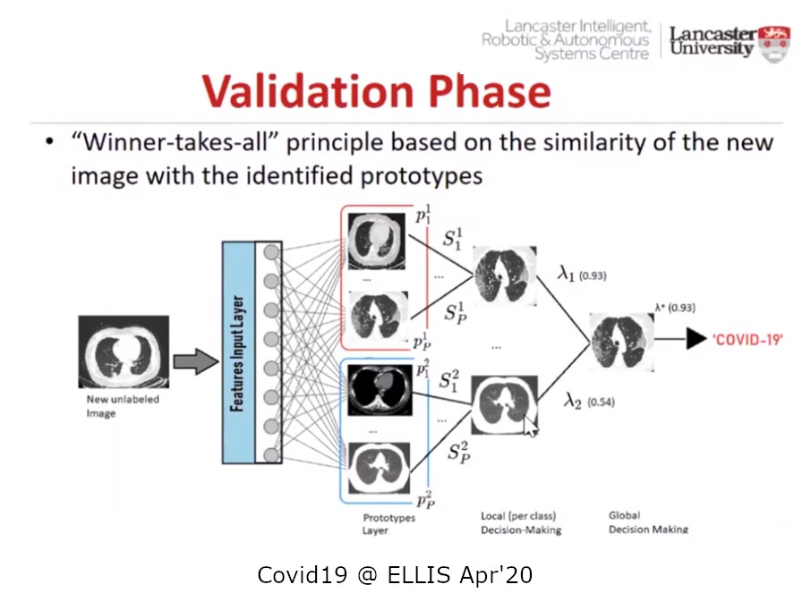

# Peter Moss COVID-19 AI Research Project
## COVID-19 xDNN Classifiers

    

&nbsp;

# Table Of Contents

- [Introduction](#introduction)
- [Lira](#lira)
    - [xDNN](#xdnn)
        - [Paper](#paper)
        - [Code](#code)
        - [Data](#data)
- [Projects](#projects)
    - [Matlab](#matlab)
    - [Python](#python)
- [Attribution](#attribution)
- [Contributing](#contributing)
    - [Contributors](#contributors)
- [Versioning](#versioning)
- [License](#license)
- [Bugs/Issues](#bugs-issues)

&nbsp;

# Introduction
The COVID-19 xDNN Classifiers are based on the work of our collaborators, Plamenlancaster: [Professor Plamen Angelov](https://www.lancaster.ac.uk/lira/people/#d.en.397371) from [Lancaster University](https://www.lancaster.ac.uk/)/ Centre Director @ [Lira](https://www.lancaster.ac.uk/lira/), & his researcher,  [Eduardo Soares PhD](https://www.lancaster.ac.uk/sci-tech/about-us/people/eduardo-almeida-soares). This repository provides a Matlab and Python implementation of their eXplainable DNN architecture.

These projects show how eXplainable Deep Learning (xDNN), can be utilized on the edge, providing real-time predictions for medical support applications using intelligent networks. In this case, the projects make up part of the [HIAS Intelligent Network](https://github.com/LeukemiaAiResearch/HIAS/)

The programs serve a local API endpoint allowing devices and applications on the network to communicate with the model and do real-time inference on the edge. IoT connectivity is provided by the local HIAS iotJumpWay broker and allows for device to device/application communication. To infer against the model, we have provided integration with the HIAS UI.

&nbsp;

# Lira
>"Lancaster Intelligent, Robotic and Autonomous systems (LIRA) Research Centre was set up in early 2018 with the aim to bring together the diverse research excellence and expertise in the areas of Intelligent, Robotic and Autonomous Systems (IRAS). Its core is formed by 30 academics from a range of departments across different Faculties and can be seen here. LIRA is multi-disciplinary by design. It covers aspects as diverse as engineering, computing, psychology, management, etc."

- [Source](https://www.lancaster.ac.uk/lira/)

## xDNN

- [ELLIS Against COVID19 Youtube (Source)](https://www.youtube.com/watch?v=7RtDgGkxavc)
- [Peter Moss COVID-19 AI Research Project Facebook Video](https://www.facebook.com/covid19airesearch/videos/271817930672659)

### Paper
- Medrxiv: [SARS-CoV-2 CT-scan dataset: A large dataset of real patients CT scans for SARS-CoV-2 identification](https://www.medrxiv.org/content/10.1101/2020.04.24.20078584v3) - Eduardo Soares, Plamen Angelov, Sarah Biaso, Michele Higa Froes, Daniel Kanda Abe.

### Code
- Github: [Plamen-Eduardo / xDNN-SARS-CoV-2-CT-Scan](https://github.com/Plamen-Eduardo/xDNN-SARS-CoV-2-CT-Scan)

### Data
- Kaggle: [SARS-CoV-2 CT-scan dataset: A large dataset of real patients CT scans for SARS-CoV-2 (COVID-19) identification](https://www.kaggle.com/plameneduardo/sarscov2-ctscan-dataset)

&nbsp;

# Projects
This repository provides a Matlab and Python implementation of Plamenlancaster's eXplainable DNN architecture.

## Matlab
The COVID-19 xDNN Matlab Classifiers are based on the architecture proposed in [SARS-CoV-2 CT-scan dataset: A large dataset of real patients CT scans for SARS-CoV-2 identification](https://www.medrxiv.org/content/10.1101/2020.04.24.20078584v3) by Eduardo Soares, Plamen Angelov, Sarah Biaso, Michele Higa Froes, Daniel Kanda Abe.

| Project  | Description  | Author(s)  |
| --- | ---------------- | ---------------- |
| [Project 1](Projects/Matlab/1 "Project 1")   | In this research, we have used Matlab and the publicly available SARS-COV-2 Ct-Scan Dataset by our collaborators, Plamenlancaster: Professor Plamen Angelov from Lancaster University/ Centre Director @ Lira, & his researcher, Eduardo Soares PhD.  |  [Aniruddh Sharma](https://www.leukemiaresearchassociation.ai/team/aniruddh-sharma "Aniruddh Sharma") & [Nitin Mane](https://www.leukemiaresearchassociation.ai/team/nitin-mane "Nitin Mane") |

## Python
The COVID-19 xDNN Python Classifiers are based on the architecture proposed in [SARS-CoV-2 CT-scan dataset: A large dataset of real patients CT scans for SARS-CoV-2 identification](https://www.medrxiv.org/content/10.1101/2020.04.24.20078584v3) by Eduardo Soares, Plamen Angelov, Sarah Biaso, Michele Higa Froes, Daniel Kanda Abe.

| Project  | Description  | Author(s)  |
| --- | ---------------- | ---------------- |
| [Project 1](Projects/Python/1 "Project 1")   | In this research, we have used Python and the publicly available SARS-COV-2 Ct-Scan Dataset by our collaborators, Plamenlancaster: Professor Plamen Angelov from Lancaster University/ Centre Director @ Lira, & his researcher, Eduardo Soares PhD.  |  [Nitin Mane](https://www.leukemiaresearchassociation.ai/team/nitin-mane "Nitin Mane") |

&nbsp;

# Attribution
These projects were made possible through our collaboration with Plamenlancaster: [Professor Plamen Angelov](https://www.lancaster.ac.uk/lira/people/#d.en.397371) from [Lancaster University](https://www.lancaster.ac.uk/)/ Centre Director @ [Lira](https://www.lancaster.ac.uk/lira/), & his researcher,  [Eduardo Soares PhD](https://www.lancaster.ac.uk/sci-tech/about-us/people/eduardo-almeida-soares). We would like to thank them for this opportunity to work on such an amazing project.

&nbsp;

# Contributing

Peter Moss COVID-19 AI Research Project encourages and welcomes code contributions, bug fixes and enhancements from the Github.

Please read the [CONTRIBUTING](CONTRIBUTING.md "CONTRIBUTING") document for a full guide to forking our repositories and submitting your pull requests. You will also find information about our code of conduct on this page.

## Contributors

- [Aniruddh Sharma](https://www.leukemiaresearchassociation.ai/team/aniruddh-sharma "Aniruddh Sharma") - [Asociacion De Investigatcion En Inteligencia Artificial Para La Leucemia Peter Moss](https://www.leukemiaresearchassociation.ai "Asociacion De Investigacion En Inteligencia Artificial Para La Leucemia Peter Moss") R&D Junior, Ahmedabad, Gujarat, India

- [Nitin Mane](https://www.leukemiaresearchassociation.ai/team/nitin-mane "Nitin Mane") - [Asociacion De Investigatcion En Inteligencia Artificial Para La Leucemia Peter Moss](https://www.leukemiaresearchassociation.ai "Asociacion De Investigacion En Inteligencia Artificial Para La Leucemia Peter Moss") AI R&D, Aurangabad, India

&nbsp;

# Versioning

We use SemVer for versioning. For the versions available, see [Releases](releases "Releases").

&nbsp;

# License

This project is licensed under the **MIT License** - see the [LICENSE](LICENSE "LICENSE") file for details.

&nbsp;

# Bugs/Issues

We use the [repo issues](issues "repo issues") to track bugs and general requests related to using this project. See [CONTRIBUTING](CONTRIBUTING.md "CONTRIBUTING") for more info on how to submit bugs, feature requests and proposals.